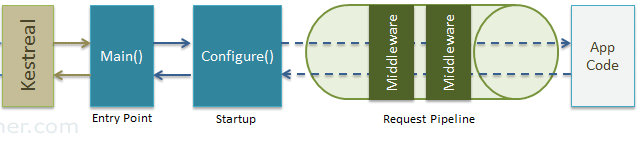

# Blueprint Backend .NET Core 3.1

## Usage

### Folder structure

Here's a folder structure for a Blueprint Backend .NET :

```

WITNetCoreProject/                  # Root directory.

|- WITNetCoreProject/               # Folder used to Main Project.

|- WITNetCoreProject/Controllers/   # Folder used to define all the controller files.

|- WITNetCoreProject/Extensions/    # Folder used to extend the middleware configurations.

|- WITNetCoreProject/Models/        # Folder used to define context, mappings, and data view object.

|- WITNetCoreProject/Properties/    # Folder used to configure launch setting of the program.

|- WITNetCoreProject/Services/      # Folder used to define repositories, interfaces, and logs.

|- WITNetCoreProject/Utilities/     # Folder used to define static classes or enum classes.

|- WITNetCoreProject/Validators/    # Folder used to define validator classes.

|- appsetting.json                  # File to define all configuration such as token,           connection string, Jwt Token configuration and also to define the environment of this program.

|- nlog.config                      # File to define configuration of the logger.

|- program.cs                       # a console project which starts executing from the entry point public static void Main() in Program class where we can create a host for the web application.

|- startup.config                   # File that executed first when the application starts.

|- WITNetCoreProject.UnitTests/                      # Folder used to Unit Test Project.

|- WITNetCoreProject.UnitTests/Controllers/          # Folder used to define all the controller for tests.

|- WITNetCoreProject.UnitTests/Repositories/         # Folder used to define all repositories for tests.

|- WITNetCoreProject.UnitTests/Services/             # Folder used to define required instance in test environment.

|- WITNetCoreProject.UnitTests/SharedDatabaseSetup/  # Folder used to define in memory database and mocking database for test environment.

|- WITNetCoreProject.UnitTests/UnitTests/            # Folder used to define all the required unit tests.

```

### Program & Startup Class

### Program class

`Program.cs` is where the application starts. Program.cs class file is entry point of our application and creates an instance of IWebHost which hosts a web application.

```
public partial class Program {

    public static void Main(string[] args) {

        CreateHostBuilder(args).Build().Run();
    }

    public static IHostBuilder CreateHostBuilder(string[] args) =>
        Host.CreateDefaultBuilder(args)
            .ConfigureWebHostDefaults(webBuilder => {

                webBuilder.UseStartup<Startup>();
            });
    }

```

WebHost is used to create instance of IWebHost and `IWebHostBuilder` and `IWebHostBuilder` which are pre-configured defaults. The `CreateDefaultBuilder()` method creates a new instance of `WebHostBuilder`.
`UseStartup<startup>()` method specifies the Startup class to be used by the web host. We can also specify our custom class in place of startup.
`Build()` method returns an instance of `IWebHost` and `Run()` starts web application until it stops. `Program.cs` in ASP.NET Core makes it easy for us to setup a web host.

#### Startup Class

Startup class can be decorated with any access modifier like public, private, internal. Multiple Startup classes are allowed in a single application. ASP.NET Core will select the appropriate class based on its enviroment.

If a class Startup{EnvironmentName} exists, that class will be called for that EnvironmentName or Environment Specific startup file will be executed to avoid frequent changes of code/setting/configuration based on environment.

ASP.NET Core supports multiple environment variables like Development, Production and Staging. It reads the environment variable ASPNETCORE_ENVIRONMENT at application startup and store value into Hosting Environment interface.

Should we need to define class name with startup.cs? No, it is not necessary, that class name should be Startup.

We can define two methods in startup file like ConfigureServices and Configure along with constructor.

```
public class Startup {
    // Use this method to add services to the container.
    public void ConfigureServices(IServiceCollection services) {
        ...
    }
    // Use this method to configure the HTTP request pipeline.
    public void Configure(IApplicationBuilder app) {
        ...
    }
}

```

#### ASP.NET Core - Dependency Injection

ASP.NET Core is designed from scratch to support Dependency Injection. ASP.NET Core injects objects of dependency classes through constructor or method by using built-in IoC container.

##### Built-in IoC Container

ASP.NET Core framework contains simple out-of-the-box IoC container which does not have as many features as other third party IoC containers. If you want more features such as auto-registration, scanning, interceptors, or decorators then you may replace built-in IoC container with a third party container.

The built-in container is represented by `IServiceProvider` implementation that supports constructor injection by default. The types (classes) managed by built-in IoC container are called services.

There are basically two types of services in ASP.NET Core:

- Framework Services: Services which are a part of ASP.NET Core framework such as IApplicationBuilder, IHostingEnvironment, ILoggerFactory etc.
- Application Services: The services (custom types or classes) which you as a programmer create for your application.

In order to let the IoC container automatically inject our application services, we first need to register them with IoC container.

##### Registering Application Service

Consider the following example of simple `NLog` interface and its implementation class. We will see how to register it with built-in IoC container and use it in our application.

```
public interface ILoggerManager {

    void LogInfo(string message);
    void LogWarn(string message);
    void LogDebug(string message);
    void LogError(string message);
}

public class LoggerManagerRepository : ILoggerManager {

    private static ILogger logger = LogManager.GetCurrentClassLogger();

    public void LogDebug(string message) {

        logger.Debug(message);
    }

    public void LogError(string message) {

        logger.Error(message);
    }

    public void LogInfo(string message) {

        logger.Info(message);
    }

    public void LogWarn(string message) {

        logger.Warn(message);
    }
}

```

ASP.NET Core allows us to register our application services with IoC container, in the `ConfigureServices` method of the Startup class. The `ConfigureServices` method includes a parameter of `IServiceCollection` type which is used to register application services.

Let's register above `NLog` with IoC container in ConfigureServices() method as shown below.

```
public class Startup
{
    public static void ConfigureLoggerService(this IServiceCollection services) {

        services.AddSingleton<ILoggerManager, LoggerManagerRepository>();
    }

    // other code removed for clarity..
}

```

As you can see above, `Add()` method of `IServiceCollection` instance is used to register a service with an IoC container. The ServiceDescriptor is used to specify a service type and its instance. We have specified `NLog` as service type and `MyConsoleLogger` as its instance. This will register `NLog` service as a singleton by default. Now, an IoC container will create a singleton object of `MyConsoleLogger` class and inject it in the constructor of classes wherever we include `NLog` as a constructor or method parameter throughout the application.

Thus, we can register our custom application services with an IoC container in ASP.NET Core application. There are other extension methods available for quick and easy registration of services which we will see later in this chapter.

#### Entity Framework Core

The `DbContext` class is an integral part of Entity Framework. An instance of `DbContext` represents a session with the database which can be used to query and save instances of your entities to a database. `DbContext` is a combination of the Unit Of Work and Repository patterns.

`DbContext` in EF Core allows us to perform following tasks:

- Manage database connection
- Configure model & relationship
- Querying database
- Saving data to the database
- Configure change tracking
- Caching
- Transaction management

To use `DbContext` in our application, we need to create the class that derives from `DbContext`, also known as context class. This context class typically includes DbSet<TEntity> properties for each entity in the model. Consider the following example of context class in EF Core.

```
public class RepositoryContext : DbContext
{
    public RepositoryContext(DbContextOptions options) : base(options)
    {

    }

    protected override void OnModelCreating(ModelBuilder modelBuilder)
    {
    }
    //entities
    public DbSet<Users> Users { get; set; }
    public DbSet<RefreshTokens> RefreshTokens { get; set; }
}

```

In the example above, the `RepositoryContext` class is derived from the `DbContext` class and contains the `DbSet<TEntity>` properties of `Users` and `RefreshTokens` type. We must create an instance of `RepositoryContext` to connect to the database and save or retrieve `Users` or `RefreshTokens` data.

#### Middlewares

##### What is Middleware?

ASP.NET Core introduced a new concept called Middleware. A middleware is nothing but a component (class) which is executed on every request in ASP.NET Core application. In the classic ASP.NET, HttpHandlers and HttpModules were part of request pipeline. Middleware is similar to HttpHandlers and HttpModules where both needs to be configured and executed in each request.

Typically, there will be multiple middleware in ASP.NET Core web application. It can be either framework provided middleware, added via NuGet or your own custom middleware. We can set the order of middleware execution in the request pipeline. Each middleware adds or modifies http request and optionally passes control to the next middleware component. The following figure illustrates the execution of middleware components.


Middlewares build the request pipeline. The following figure illustrates the ASP.NET Core request processing.



##### Configure Middleware

We can configure middleware in the `Configure` method of the Startup class using `IApplicationBuilder` instance. The following example adds a single middleware using Run method which returns a string "Hello World!" on each request.

```
public class Startup
{
    public Startup()
    {
    }
    public void Configure(IApplicationBuilder app, IHostingEnvironment env, ILoggerFactory loggerFactory)
    {
        //configure middleware using IApplicationBuilder here..

        app.Run(async (context) =>
        {
            await context.Response.WriteAsync("Hello World!");

        });

        // other code removed for clarity..
    }
}

```

In the above example, `Run()` is an extension method on `IApplicationBuilder` instance which adds a terminal middleware to the application's request pipeline. The above configured middleware returns a response with a string "Hello World!" for each request.

#### Authentication & Authorization

In this post, we take a look at another middleware, the `JwtBearerAuthenticationMiddleware`, again looking at how it is implemented in ASP.NET Core as a means to understanding authentication in the framework in general.

##### Jwt Bearer in ASP.NET Core

You can add JWT bearer authentication to your ASP.NET Core application using the `Microsoft.AspNetCore.Authentication.JwtBearer` package. This provides middleware to allow validating and extracting JWT bearer tokens from a header. There is currently no built-in mechanism for generating the tokens from your application, but if you need that functionality, there are a number of possible projects and solutions to enable that such as IdentityServer 4.

Once you have added the package to your project.json, you need to add the middleware to your `Startup` class. This will allow you to validate the token and, if valid, create a `ClaimsPrinciple` from the claims it contains.

You can add the middleware to your application using the `UseJwtBearerAuthentication` extension method in your `Startup.Configure` method, passing in a `JwtBearerOptions` object:

```
AuthenticationConfiguration authenticationConfiguration = new AuthenticationConfiguration();
Configuration.Bind("Authentication", authenticationConfiguration);

services.AddSingleton(authenticationConfiguration);

services.AddAuthentication(JwtBearerDefaults.AuthenticationScheme)
    .AddJwtBearer(config => {

        config.TokenValidationParameters = new TokenValidationParameters() {

            IssuerSigningKey = new SymmetricSecurityKey(Encoding.UTF8.GetBytes(authenticationConfiguration.AccessTokenSecret)),
            ValidIssuer = authenticationConfiguration.Issuer,
            ValidAudience = authenticationConfiguration.Audience,
            ValidateIssuerSigningKey = true,
            ValidateIssuer = true,
            ValidateAudience = true,
            ClockSkew = TimeSpan.Zero
        };
    })
    .AddCookie("Cookies", options => {

        options.Cookie.IsEssential = true;
        options.Cookie.Name = "LoginAuthentication";
        options.Cookie.SameSite = SameSiteMode.None;
        options.Cookie.SecurePolicy = CookieSecurePolicy.Always;
        options.Events = new CookieAuthenticationEvents {

            OnRedirectToLogin = redirectContext => {

                redirectContext.HttpContext.Response.StatusCode = 401;
                return Task.CompletedTask;
            }
        };
    });

services.AddAuthorization(options => {

    var defaultAuthorizationPolicyBuilder = new AuthorizationPolicyBuilder(
        JwtBearerDefaults.AuthenticationScheme);

    defaultAuthorizationPolicyBuilder =
        defaultAuthorizationPolicyBuilder.RequireAuthenticatedUser();

    options.DefaultPolicy = defaultAuthorizationPolicyBuilder.Build();
});

```

There are many options available on the `JwtBearerOptions` - we'll cover some of these in more detail later.

#### AutoMapper

When working on applications, you might typically want to map objects pertaining to similar or dissimilar types. Here is why you often need this: The models (also called entities) in an application typically map with the database tables of the database in use. So, if you have a model class named Product, it will have properties that correspond to each of the fields of the Product table in the database. However, not all fields of the Product class might be needed in the presentation layer. You may just want to have three properties such as Id, Name, and Price in the product entity in the presentation layer of your application.

When you would like to send data to the presentation layer from the business layer of your application, you might need additional properties that do not match with the models defined in the application. As an example, you might need a few additional properties for your product entity in the presentation layer such as ReorderLevel, ReorderValue, and NetPrice that are absent in the Product class.

So, there often exists a mismatch between the properties of the model classes and those of the data transfer object classes. This might create problems for you since you might need to write a lot of boilerplate code to convert instances of incompatible types. If you are working on a large application such as an ERP, you might need many models and data transfer object classes. It would be cumbersome to write code to do the mapping manually. Here is where tools like AutoMapper helps.

Thus, we can register our AutoMapper with an IoC container in ASP.NET Core application. There are other extension methods available for quick and easy registration of services which we will see later in this chapter.
