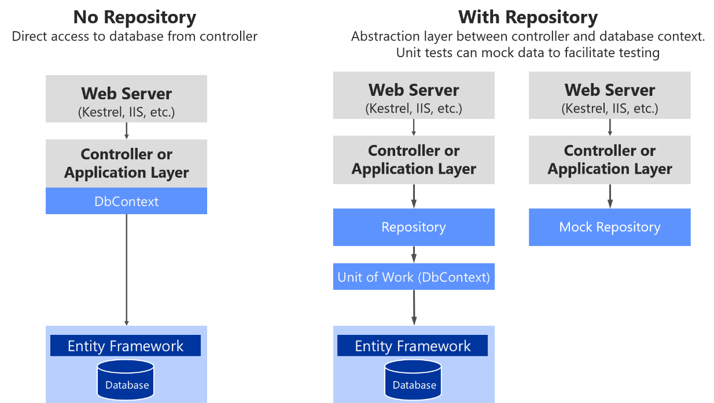

# Blueprint Backend .NET Core 3.1

## Repository Pattern

In this WITNetCoreProject, we will go through everything you will need to know about Repository Pattern in ASP.NET Core, Generic Repository Patterns, Unit of Work and related topics.

### What is Repository Pattern?

A Repository pattern is a design pattern that mediates data from and to the Domain and Data Access Layers ( like Entity Framework Core / Dapper). Repositories are classes that hide the logics required to store or retreive data. Thus, our application will not care about what kind of ORM we are using, as everything related to the ORM is handled within a repository layer. This allows you to have a cleaner seperation of concerns. Repository pattern is one of the heavily used Design Patterns to build cleaner solutions.

Microsoft themselves recommend using Repository Patterns in complex scenarios to reduce the coupling and provide better Testability of your solutions. In cases where you want the simplest possible code, you would want to avoid the Repository Pattern.



Adding the Repository has it is own benefits too. But i strongly advice to not use Design Patterns everywhere. Try to use it only whenever the scenario demands the usage of a Design Pattern. That being stated, Repository pattern is something that can benefit you in the long run.

### Implementing Repository Pattern in ASP.NET Core 3.1

what you need to know to implement Repository Pattern in this Project is this guidelines, and we will also be working with a Clean Architecture in mind to demonstrate the real-life implementation. This means that we will be working with multiple Layers and Projects and also go through the basics of Dependency Inversion Principle.

#### Setting up the Entities and EFCore

Now, lets take a look at `WITNetCoreProject/Models/Entities`. Create a new `Users` and `RefreshTokens` files in the Entities Folder.

```
[Table("TB_Users")]
public class Users {

    public Users() {

        RefreshTokens = new HashSet<RefreshTokens>();
    }

    [Key]
    public Guid UserId { get; set; }
    [Required]
    [StringLength(15)]
    public string Username { get; set; }
    [Required]
    [StringLength(15)]
    public string Password { get; set; }
    [Required]
    [StringLength(64)]
    public string DisplayName { get; set; }
    [Required]
    [StringLength(64)]
    public string Phone { get; set; }
    [Required]
    [StringLength(64)]
    public string Email { get; set; }
    public DateTime CreatedAt { get; set; }
    [Required]
    [StringLength(64)]
    public string CreatedBy { get; set; }
    public DateTime UpdatedAt { get; set; }
    [Required]
    [StringLength(64)]
    public string UpdatedBy { get; set; }
    public bool? IsDeleted { get; set; }

    [InverseProperty("User")]
    public virtual ICollection<RefreshTokens> RefreshTokens { get; set; }
}
```

```
[Table("TB_Refresh_Tokens")]
public class RefreshTokens {

    public RefreshTokens() {
    }

    [Key]
    public Guid Id { get; set; }
    public Guid UserId { get; set; }
    [Required]
    [StringLength(int.MaxValue)]
    public string Token { get; set; }

    [ForeignKey("UserId")]
    [InverseProperty("RefreshTokens")]
    public virtual Users User { get; set; }
}

```

we already talked about the `RepositoryContext` class, add reference those class `Users` and `RefreshTokens` classes to `RepositoryContext` class.

```
public class RepositoryContext : DbContext
{
    public RepositoryContext(DbContextOptions options) : base(options)
    {

    }

    protected override void OnModelCreating(ModelBuilder modelBuilder)
    {
    }
    //entities
    public DbSet<Users> Users { get; set; }
    public DbSet<RefreshTokens> RefreshTokens { get; set; }
}

```

Next, Navigate to `Startup.cs` and add this line to Register the `RepositoryContext` class that we created.

```
public static void ConfigureMySqlContext(this IServiceCollection services, IConfiguration config) {

    var connectionString = config["sqlconnection:connectionString"];
    services.AddDbContext<RepositoryContext>(p => p.UseNpgsql(connectionString));
}
```

After that, open up the appsettings.json file in the `WITNetCoreProject/` and add the connection string.

```
"sqlconnection": {
    "connectionString": "User ID =postgres;Password=Bandung2022;Server=172.104.179.149;Port=5432;Database=MyDB;Integrated Security=true;Pooling=true;"
},
```

Finally, Lets update the database. Open your Package Manager Console on Visual Studio and run the following commands.

```
dotnet ef migrations add "Initial"
dotnet ef database update

```

After this command you already have a migrations folder including new `Date_Initial.cs` files and `RepositoryContextModelSnapshot.cs` files inside the folder, and also 2 new tables in your PostgreSQL database.

#### Building a Generic Repository

We will be inverting the dependencies, so that, you can define the interface in the Services folder, but the implementation can be outside the Services Folder. In this case, the implementations will go the Main Project. Thus, your Main Project layer will not depends on anything, rather, the other layers tend to depend on the Main Project Layers interface. This is a simple explanation of Dependency Inversion Principle.

Take a look in `WITNetCoreProject/Services/Interfaces`, `Interfaces/IBaseProfileRepository.cs`

```
public interface IBaseProfileRepository<T> {

    IQueryable<T> FindAll();
    IQueryable<T> FindByCondition(Expression<Func<T, bool>> expression);
    void Create(T entity);
    void Update(T entity);
    void Delete(T entity);
}

```

This will be a Generic Interface, that can be used for both the Developer and Project Classes. Here T is the specific class.

The set of functions depends on your preference. Ideally, we require 5 functions that cover most of the data handling part.

- Find all the data from the database.
- Find By Condition from the database.
- Add a new record to the context
- Update a record to the context
- Delete a record to the context

Now, Lets take a look into `WITNetCoreProject/Services/Repositories`,`Repositories/BaseRepository.cs`

```
public abstract class BaseRepository<T> : IBaseProfileRepository<T> where T : class {

    protected RepositoryContext RepositoryContext { get; set; }

    public BaseRepository(RepositoryContext repositoryContext) {

        this.RepositoryContext = repositoryContext;
    }

    public IQueryable<T> FindAll() {

        return this.RepositoryContext.Set<T>().AsNoTracking();
    }

    public IQueryable<T> FindByCondition(Expression<Func<T, bool>> expression) {

        return this.RepositoryContext.Set<T>().Where(expression).AsNoTracking();
    }

    public void Create(T entity) {

        this.RepositoryContext.Set<T>().Add(entity);
    }

    public void Update(T entity) {

        this.RepositoryContext.Set<T>().Update(entity);
    }

    public void Delete(T entity) {

        this.RepositoryContext.Set<T>().Remove(entity);
    }
}

```

This class will implement the `IGenericRepository` Interface. We will also inject the `RepositoryContext` here. This way we are hiding all the actions related to the `dbContext` object within Repository Classes. Also note that, for the ADD and Remove Functions, we just do the operation on the dbContext object. But we are not yet commiting/updating/saving the changes to the database whatsover. This is not something to be done in a Repository Class. We would need Unit of Work Pattern for these cases where you commit data to the database. We will discuss about Unit of Work in a later section.

#### Inheriting and Extending the Generic Repository

In the `WITNetCoreProject/`, under the Interfaces, take a look at interface folder named `IUserProfileRepository` file.

```
public interface IUserProfileRepository : IBaseProfileRepository<Users> {

    Task<IEnumerable<Users>> GetUsers();

    Task<Users> GetUserById(Guid userId);

    Task<Users> GetUserByUsername(string username);

    Task<Users> GetUserIdByEmail(string email);

    void DeleteUserById(Guid userId);

    void CreateUser(Users user);

    void UpdateUser(Users user);
}

```

Here we are inheriting all the Functions of the Generic Repository, as well as adding one of a Function called `GetUsers`. Get it?

and then implement the IUserProfileRepository. Go to the `WITNetCoreProject/` and under Repositories folder, take a look at UserRepository class.

```

public class UserRepository : BaseRepository<Users>, IUserProfileRepository {

    public UserRepository(RepositoryContext repositoryContext) : base(repositoryContext) {
    }

    public void CreateUser(Users user) {

        Create(user);
    }

    public void DeleteUserById(Guid userId) {

        var user = this.RepositoryContext.Users.Find(userId);

        if (user != null) {

            this.RepositoryContext.Users.Remove(user);
            this.RepositoryContext.SaveChanges();
        }
        else {

            throw new NotFoundException(System.Net.HttpStatusCode.NotFound,"User with user id : " +userId+ " could not be found in database");
        }
    }

    public async Task<Users> GetUserById(Guid userId) {

        return await FindByCondition(us => us.UserId.Equals(userId)).Where(us => us.IsDeleted == false).AsNoTracking().FirstOrDefaultAsync();
    }

    public async Task<Users> GetUserByUsername(string username) {

        return await FindByCondition(us => us.Username.Equals(username)).Where(us => us.IsDeleted == false).AsNoTracking().FirstOrDefaultAsync();
    }

    public async Task<Users> GetUserIdByEmail(string email) {

        return await FindByCondition(us => us.Email.Equals(email)).Where(us => us.IsDeleted == false).AsNoTracking().FirstOrDefaultAsync();
    }

    public async Task<IEnumerable<Users>> GetUsers() {

        return await FindAll()
            .Where(ow => ow.IsDeleted == false).AsNoTracking().ToListAsync();
    }

    public void UpdateUser(Users user) {

        Update(user);
    }
}

```

Finally we already implemented repository pattern in our program, before that to make easier to register these repositories to the service, we need a repository wrapper.

#### Repository Wrapper

Repository Wrapper is a design wrapper with which you can expose various respostiories in our application. It has very similar properties of `dbContext`, just that Repository Wrapper is not coupled to any framework like `dbContext` to Entity Framework Core.

Till now, we have built a couple of repositories. We can easily inject these repositories to the constructor of the Services classes and access data. This is quite easy when you have just 2 or 3 repository objects involved. What happens when there are quite more than 3 repositories. It would not be practical to keep adding new injections every now and then. Inorder to wrap all the Repositories to a Single Object, we use Unit Of Work.

Repository Wrapper is responsible for exposing the available Repositories and to Commit Changes to the DataSource ensuring a full transaction, without loss of data.

The other major advantage is that, multiple repository objects will have different instances of `dbcontext` within them. This can lead to data leaks in complex cases.

Lets say that you have a requirement to insert a new Developer and a new Project within the same transaction. What happens when the new Developer gets inserted but the Project Repository fails for some reason. In real-world scenarios, this is quite fatal. We will need to ensure that both the repositories work well, before commiting any change to the database. This is exactly why we decided to not include SaveChanges in any of the repostories. Clear?

Rather, the SaveChanges will be available in the `RepositoryWrapper` Class. You will get a better idea once you see the impelemntation.

Lets take a look at `IRepositoryWrapper` file in `WITNetCoreProject/Services/Interfaces`,`Interfaces/IRepositoryWrapper.cs`

```
public interface IRepositoryWrapper {

    IUserProfileRepository User { get; }
    void Save();
}

```

You can see that we are listing the interfaces of the required Repositories within the Repository Wrapper Interface. Finally we have a Complete Function which will save the changes to the database.

lets take a look how to implement this interface. look the implementation at the `WITNetCoreProject/Services/Repositories`, `Repositories/IRepositoryWrapper.cs`

```
public class RepositoryWrapper : IRepositoryWrapper {

    private RepositoryContext _repoContext;
    private IUserProfileRepository _user;

    public RepositoryWrapper(RepositoryContext repositoryContext) {

        _repoContext = repositoryContext;
    }

    public IUserProfileRepository User {

        get {

            if (_user == null) {

                _user = new UserRepository(_repoContext);
            }
            return _user;
        }
    }

    public void Save() {

        _repoContext.SaveChanges();
    }
}

```

Note that, Here we are injecting a private RepositoryContext. Lets wire up or controllers with these Repositories. Ideally you would want to have a service layer between the Repository and Controllers. But, to keep things fairly simple, we will avoid the service layer now.

Before that, lets not forget to register the IRepositoryWrapper Interface in our Application. Navigate to `WITNetCoreProject/Extensions/ServiceExtensions.cs` Method and look at this class.

```
public static void ConfigureRepositoryWrapper(this IServiceCollection services) {

    services.AddScoped<IRepositoryWrapper, RepositoryWrapper>();
}

```

#### Wiring up with an API Controller

Take a look at `WITNetCoreProject/Controllers/UserApiController` in the Main Project under the Controllers folder.

```
[Authorize]
[Route("api/[controller]/[action]")]
[ApiController]
[Consumes(MediaTypeNames.Application.Json)]
[Produces("application/json")]
public class UserApiController : ControllerBase {

    private IRepositoryWrapper _repoWrapper;

    public UserApiController(IRepositoryWrapper repoWrapper) {

        _repoWrapper = repoWrapper;
    }

    /// <summary>
    /// Get all users
    /// </summary>
    /// <response code="200">Returns the users</response>
    [Authorize]
    [HttpGet]
    [ProducesResponseType(StatusCodes.Status200OK, Type = typeof(List<UserDto>))]
    public async Task<ActionResult> GetUsers() {

        // using header {bearer (token)}
        string rawUserId = HttpContext.User.FindFirstValue("id");

        if (!Guid.TryParse(rawUserId, out Guid userId)) {
            return Unauthorized();
        }

        // get data to repositories
        var result = await _repoWrapper.User.GetUsers();

        var usersResult = _mapper.Map<IEnumerable<UserDto>>(result);
        var count = usersResult.ToList().Count();
        //return Ok(usersResult);
        return StatusCode(200, ResponseModel.ResponseOk(usersResult, count));
    }
}

```

Here are injecting only the `IRepositoryWrapper` object. This way, you can completely avoid writing lines and lines of injections to your controllers.

Lets we did not implement `RepositoryWrapper` in our program, it can be quite fatal for applications due to data inconsistency. By introducing a `RepositoryWrapper`, we are able to store both the developer and project in one go, in a single transaction.
