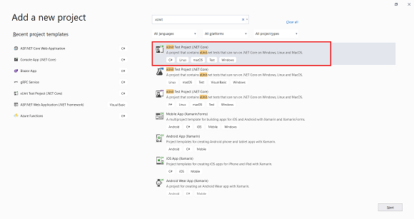

# Blueprint Backend .NET Core 3.1

## MVC Unit Tests

In this documentation, I will explain how xUnit.net in .NET Core (including .NET 3.1) works, and elaborate why unit test is important in software life-cycle.

In any software life-cycle, Testing is an important step for ensuring a good quality software application. Typically, in case of web applications, testing plays an important role. In the software applications, we have the following major testing types:

- Unit Testing
- Integration Testing
- End-to-End testing

Considering the various testing types, we are just only using unit testing in this project and also the cost of the Unit Testing is very low where as End-to-End testing proves costlier, but nevertheless important.

If we consider the number of tests required for software applications, then we can say that we must write several unit tests. How many? As a thumb rule, the overall number of methods written by developers in software applications, should be the number of unit tests you write. Also, if we have conditional statements in these methods, then we have to write one unit test per conditional statement. Cumbersome, but totally worth the cost and time put into it.

This is also the reason why unit tests are the responsibility of the developer or so to say if Test-Driven-Development approach (or user stories and test cases) is understood by the developer, then the code can be bug-free. Figure 1 shows the summary of the testing methodologies.


### Testing Methodologies Summary

In this documentation, we will be implementing Unit Testing of an ASP.NET Core 3.1 application. We will implement the Unit Test MVC Controller, API Controller by mocking their dependencies.

#### IService Interface, Repository Service, and Entity Classes

This project has repository `UserRepository` classes which implement the `IUserProfileRepository<TEntity>` interface. Using this interface, the repository services classes are registered in dependency container of the ASP.NET Core application and these classes are constructor injected in the MVC and API controllers. this code below shows the `IUserProfileRepository` interface

```
public interface IUserProfileRepository : IBaseProfileRepository<Users> {

    Task<IEnumerable<Users>> GetUsers();

    Task<Users> GetUserById(Guid userId);

    Task<Users> GetUserByUsername(string username);

    Task<Users> GetUserIdByEmail(string email);

    void DeleteUserById(Guid userId);

    void CreateUser(Users user);

    void UpdateUser(Users user);
}

```

The above interface defines asynchronous methods for performing CRUD operations. The interface is implemented by `Users` class. The `IBaseProfileRepository<TEntity>` uses the `Users` class as type for TEntity type. The User class is shown in code below

```
public class Users {

    public Users() {

        RefreshTokens = new HashSet<RefreshTokens>();
    }

    [Key]
    public Guid UserId { get; set; }
    [Required]
    [StringLength(15)]
    public string Username { get; set; }
    [Required]
    [StringLength(15)]
    public string Password { get; set; }
    [Required]
    [StringLength(64)]
    public string DisplayName { get; set; }
    [Required]
    [StringLength(64)]
    public string Phone { get; set; }
    [Required]
    [StringLength(64)]
    public string Email { get; set; }
    public DateTime CreatedAt { get; set; }
    [Required]
    [StringLength(64)]
    public string CreatedBy { get; set; }
    public DateTime UpdatedAt { get; set; }
    [Required]
    [StringLength(64)]
    public string UpdatedBy { get; set; }
    public bool? IsDeleted { get; set; }

    [InverseProperty("User")]
    public virtual ICollection<RefreshTokens> RefreshTokens { get; set; }
}

```

The `UserRepository` class is constructor injected with `RepositoryContext` class.This class is the base class for EntityFrameworkCode (EFCore). The `UserRepository` class uses `RepositoryContext` class to perform CRUD operations. All these operations are asynchronous operations. Listing 3 shows code for `UserRepository` class:

```
public class UserRepository : BaseRepository<Users>, IUserProfileRepository {

    public UserRepository(RepositoryContext repositoryContext) : base(repositoryContext) {
    }

    /// the rest of the code

    public async Task<IEnumerable<Users>> GetUsers() {

        return await FindAll()
            .Where(ow => ow.IsDeleted == false).AsNoTracking().ToListAsync();
    }

    public void UpdateUser(Users user) {

        Update(user);
    }
}

```

### Adding New xUnit Test Project

In this project i create file called `UserApiControllerTests` in folder `WITNetCoreProject.UnitTests/UnitTests/UserApiControllerTests`. before you jump to this point there are few steps that you need to know about how to add file xUnit to the project.

To add a Unit Test project in the current project, right-click on the solution and select `Add > New Project`, from the Add a new Project window select `xUnit Test Project (.NET Core)` the guide is in the picture below



The project referrers xunit package, this provides the access of the xunit object model to test ASP.NET Core applications. The Microsoft.Net.Test.Sdk package is the MSBuild targets and properties for building .NET Test projects. The xunit.runner.visualstudio package is a Test Explorer for xUnit.net framework. This is integrated with Visual Studio 2017 15.9+ update and Visual Studio 2019 version. This test runner shows the status of the tests.

To use xUnit to test the `UserApiControllerTests`, we need to add a reference of the `WITNetCoreProject` Project in the test project. Right-Click on the Dependencies of the `WITNetCoreProject.UnitTests` project and select Add project reference.

### Test Instance

After you add a reference of the `WITNetCoreProject` project to the test project, you need create a test instance we called `AppInstance` in this project and lies on `WITNetCoreProject.UnitTests/Services/AppInstance`. this code below show you how to configure the `AppInstance` in the test environment.

```
public class AppInstance : WebApplicationFactory<Startup> {

    //dependencies Injection to startup class from main project
    public WebApplicationFactory<Startup> AuthenticatedInstance(params Claim[] claimSeed) {

            return WithWebHostBuilder(builder => {

                builder.ConfigureTestServices(services => {

                    //this is how to register a test scheme in this instance
                    services.AddSingleton<IAuthenticationSchemeProvider, MockSchemeProvider>();
                    services.AddSingleton<MockClaimSeed>(_ => new(claimSeed));
                });
            });
        }
    }

    //this class is show how to replicate authentication and authorization scheme in test environment
    public class MockSchemeProvider : AuthenticationSchemeProvider {

        public MockSchemeProvider(IOptions<AuthenticationOptions> options) : base(options) {
        }

        protected MockSchemeProvider(

            IOptions<AuthenticationOptions> options,
            IDictionary<string, AuthenticationScheme> schemes
        ) : base(options, schemes) {
        }

        public override Task<AuthenticationScheme> GetSchemeAsync(string name) {

            AuthenticationScheme mockScheme = new(
                JwtBearerDefaults.AuthenticationScheme,
                JwtBearerDefaults.AuthenticationScheme,
                typeof(MockAuthenticationHandler)
            );
            return Task.FromResult(mockScheme);
        }
    }

    //this class is how jwt bearer token provided and how is token to be handled by the instance in test environment scheme
    public class MockAuthenticationHandler : AuthenticationHandler<AuthenticationSchemeOptions>
    {
        private readonly MockClaimSeed _claimSeed;

        public MockAuthenticationHandler(
            MockClaimSeed claimSeed,
            IOptionsMonitor<AuthenticationSchemeOptions> options,
            ILoggerFactory logger,
            UrlEncoder encoder,
            ISystemClock clock) : base(options, logger, encoder, clock) {
            _claimSeed = claimSeed;
        }

        protected override Task<AuthenticateResult> HandleAuthenticateAsync()
        {
            var claimsIdentity = new ClaimsIdentity(_claimSeed.getSeeds(), JwtBearerDefaults.AuthenticationScheme);
            var claimsPrincipal = new ClaimsPrincipal(claimsIdentity);
            var ticket = new AuthenticationTicket(claimsPrincipal, JwtBearerDefaults.AuthenticationScheme);
            return Task.FromResult(AuthenticateResult.Success(ticket));
        }
    }

    // this class is show you how to seed the mock token to be claimed and register to the instance
    public class MockClaimSeed
    {
        private readonly IEnumerable<Claim> _seed;

        public MockClaimSeed(IEnumerable<Claim> seed)
        {
            _seed = seed;
        }

        public IEnumerable<Claim> getSeeds() => _seed;
    }
}

```

If this code seems very confusing dont worry because this is the integral part for unit testing, I will tell you for each function in this `AppInstance` to make this documentation looks perfect. `AuthenticatedInstance` function as you see in code above is a dependency injection to startup class from main project, like when you run this project the first application it will run is `Program.cs` file and I need to make a little changes for this class type to become partial class instead of normal public class, so the `program.cs` could be able to access from project that already referenced like `WITNetCoreProject.UnitTests` in this project.

```
public partial class Program {

    public static void Main(string[] args) {

        CreateHostBuilder(args).Build().Run();
    }

    public static IHostBuilder CreateHostBuilder(string[] args) =>
        Host.CreateDefaultBuilder(args)
            .ConfigureWebHostDefaults(webBuilder => {

                webBuilder.UseStartup<Startup>();
            });
}

```

after that you will see the class of `MockSchemeProvider` inside the `AppInstance` class, `MockSchemeProvider` is supposed to be a provider scheme for what type of authorization or authentication that this application use, for this project we use Jwt Bearer for authentication so we register Jwt Bearer scheme to `MockSchemeProvider` provider in this class.

still in `AppInstance` class, as we can see there is a class called `MockAuthenticationHandler` implementing `AuthenticationHandler<AuthenticationSchemeOptions>` this class is supposed to be how to replicate the flow of Jwt Bearer is created and seed the token use `_claimSeed` variable as a `MockClaimSeed` object that we create below the `MockAuthenticationHandler` class called `MockClaimSeed` class

### The Test Data method

Let's take a look at method of called `GetAllUsers_ReturnType_OK()` in `WITNetCoreProject.UnitTests/UnitTests/UserApiControllerTests`. Here we have to keep in mind that the Test method name should represent the actual test purpose. Since we will be testing `GetAllUsers()` method returning JArrayResult with List of Users, the test method name is `GetAllUsers_ReturnType_OK()`. the code below show how `GetAllUsers_ReturnType_OK()` writes

```
public class UserApiControllerTests : IClassFixture<AppInstance>
{
    private readonly AppInstance _instance;

    public UserApiControllerTests(AppInstance instance)
    {
        _instance = instance;
    }

    // this is command to perform unit test what is data type, what is response code status, or what is controller name return form one controller
    #region snippet_UserApiControllerTests
    [Fact]
    public async Task GetAllUsers_ReturnType_OK()
    {
        //Arrange
        var client = _instance
            .AuthenticatedInstance(new Claim("id", "6bdf4a32-fc3a-489f-1f8b-08da366b3141"),
                new Claim(ClaimTypes.Name, "Mohammad Taufik Andrian"),
                new Claim(ClaimTypes.Email, "taufikandrian18@gmail.com"))
            .CreateClient(new()
            {
                AllowAutoRedirect = false,
            });

        //Act
        //var result = await controller.GetUsers();
        var response = await client.GetAsync("/api/UserApi/GetUsers");
        var stringResponse = await response.Content.ReadAsStringAsync();
        var result = JsonConvert.DeserializeObject<ResponseModel>(stringResponse);

        //Assert
        Assert.IsType<JArray>(result.Data);

    }
    #endregion
}

```

The code in above performs following operations:
`UserApiControllerTests` class is implementing `IClassFixture<AppInstance>` from `AppInstance` that we already created in the previous section after that we dont forget about the depedency injection which register `AppInstance` class for this controller needs as `_instance` jump to `GetAllUsers_ReturnType_OK()` method inside this method unit test I need to classify this method to be 3 part :

- Arrange
- Act
- Assert

those type represent the way of unit test works for example in arrage section, `client` variable is created to mock the authentication using jwt bearer scheme that we already created, after we arrange what we need in unit test needs, we need an act of test, what we need to test, we will test an endpoint called `/api/UserApi/GetUsers` from `WITNetCoreProject/Controllers/UserApiController` and the controller show in code below.

```
[Authorize]
[HttpGet]
[ProducesResponseType(StatusCodes.Status200OK, Type = typeof(List<UserDto>))]
public async Task<ActionResult> GetUsers() {

    // using header {bearer (token)}
    string rawUserId = HttpContext.User.FindFirstValue("id");

    if (!Guid.TryParse(rawUserId, out Guid userId)) {
        return Unauthorized();
    }

    // get data to repositories
    var result = await _repoWrapper.User.GetUsers();

    var usersResult = _mapper.Map<IEnumerable<UserDto>>(result);
    var count = usersResult.ToList().Count();
    //return Ok(usersResult);
    return StatusCode(200, ResponseModel.ResponseOk(usersResult, count));
}

```

The code above show how the controller works, access the repository class and return `Users` object from the repository class to send to the user, jump back to the `GetAllUsers_ReturnType_OK()` method in act section we try to get the Users object and assert value as JArrayJson.

Apply breakpoint on this test method and right-click inside this method and select option Debug Test(s) if you want to see the return value from the `GetAllUsers_ReturnType_OK()` method as shown in picture below


This will start the test debugging, we can see that the result take an object from the controller as shown in picture below.


Once debugging is done, the Test Explorer will show the test result as shown in picture below.


### The Test Explorer Will All Running Tests

Conclusion: Testing is the most important process for any software application. xUnit is an important framework for testing ASP.NET Core applications - for testing Action methods, MVC controllers and API Controllers.
